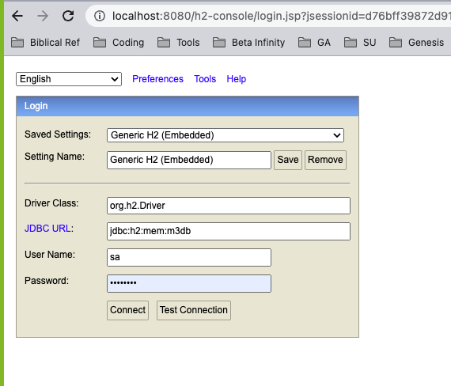

# Spring Boot Starter

## How to use

1. Fork this project
1. Add your DDL script [here](./m3project/src/main/resources/schema.sql)
1. Add your DML script [here](./m3project/src/main/resources/data.sql)
1. Continue setting up your `@Entity` classes and `@Repository` interfaces
1. You may access the database using the h2-console by visiting the `/h2-console` path [here](http://localhost:8080/h2-console).

|Key|Value|
|-|-|
|Driver Class|org.h2.Driver|
|JDBC URL|jdbc:h2:mem:m3db|
|User Name|sa|
|Password|password|

End